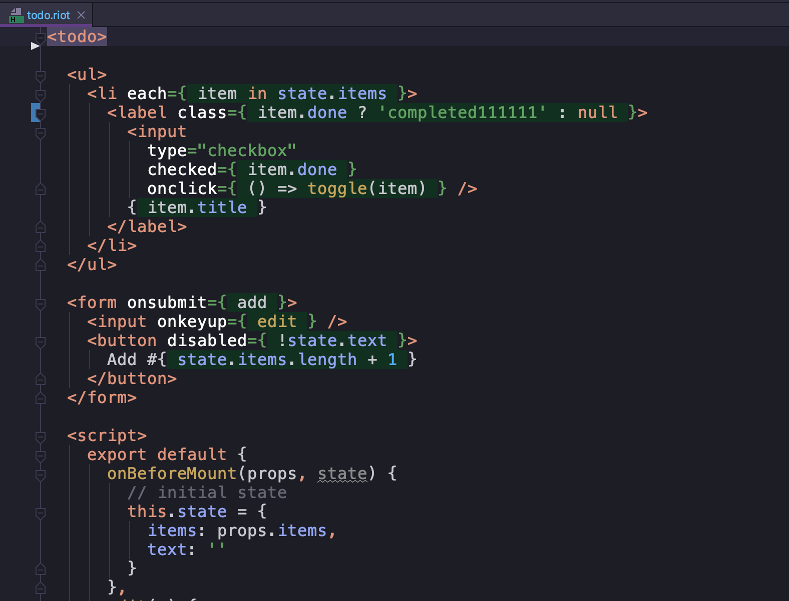

# WebStorm Riot.js plugin

The plugin can be installed in WebStorm, IntelliJ IDEA Ultimate, PhpStorm, PyCharm Pro, GoLand and RubyMine v2019.1 and above.

## Installation

To install the plugin open the IDE Preferences | Plugins, then click Browse repositories... and search for Riot.js.

## Features

* Support for ".riot" and ".tag" extension
* Parsing expressions inside xml-tags
* Navigation based on component names

## Known issues

* Riot 1,2,3 script tags are not supported
* Expression parsing uses pure stategy and doesn't allow nested braces "{" and "}"

